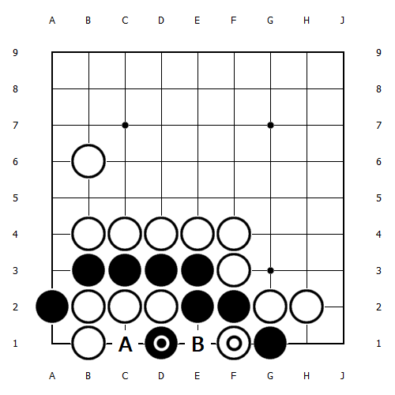
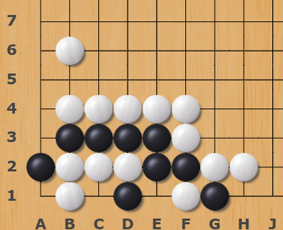
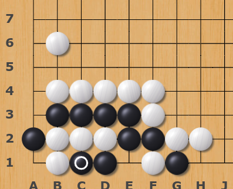
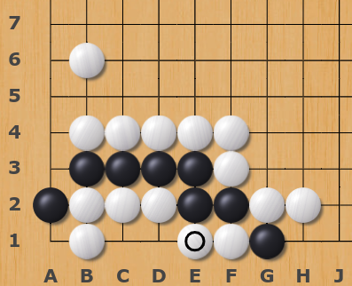
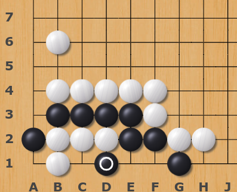
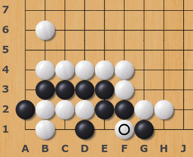
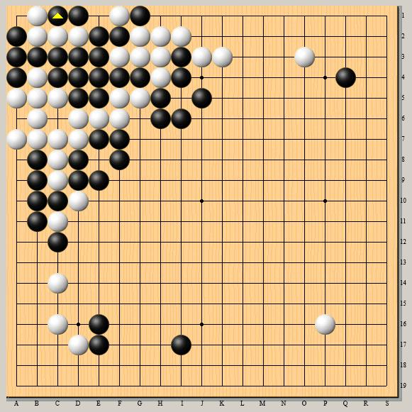
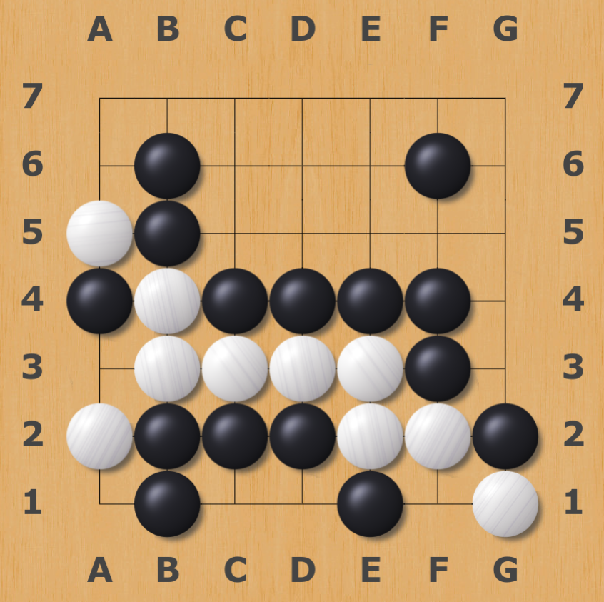

# Shape of the Week: Eternal Life
## What is the shape of Eternal Life Go?
[`Eternal life`](https://senseis.xmp.net/?EternalLife) is an extraordinary living shape in Go. It will cause a type of cycle, where the position of the board repeats. Under some rule sets, a game in which such a situation occurs can become void (no result: neither player wins, but neither player loses). Several special rules, such as super ko and the Ing Ko Rule, forbid the recurring sequence. 

## Why Endless Cycle?

First, the black cannot play at position B because if the black does, the White could play at A, and then the inner space becomes a bluky five. Even if black captures all of the white pieces inside, black will die. Therefore, to live, black has to play at position A. However, a cycle occurs as a result, over and over, and the game lasts forever. 

## Professional Games

Though rare, Eternal life does happen in professional games. There are [three recorded](https://sports.eastday.com/a/191024173911415000000.html) professional games ended in a tie because of this shape.

The most recent one happened in the Korean professional Go League in 2013, by An Sungjoon and Choe Cheol-han. There was an eternal life shape in the upper left corner, and none of the players could yield, so the game ended in a tie.

Though recent Chinese Go rule use [PSK](https://senseis.xmp.net/?PositionalVsSituationalSuperko), which prohibits a board play from repeating a position, regardless of whose turn it was when that position was first reached, in practice, referees and players prefer to no result when eternal life shape occurs.

## Thought-provoking Problem - [The True Eternal Life (tsumego)](https://www.bilibili.com/video/BV1oJ411q7yr)

In extreme situations, we could use the shape of eternal life to live, and here is a tsumego challenge! (Credit to Bilibili content creator [云小天1118](https://space.bilibili.com/282175413)) 

There are two possible eternal life shapes in this special 7 x 7 board. But which one could help the white to live? (White first to live) Let's play.

Solution: [https://www.bilibili.com/video/BV1oJ411q7yr](https://www.bilibili.com/video/BV1oJ411q7yr)

