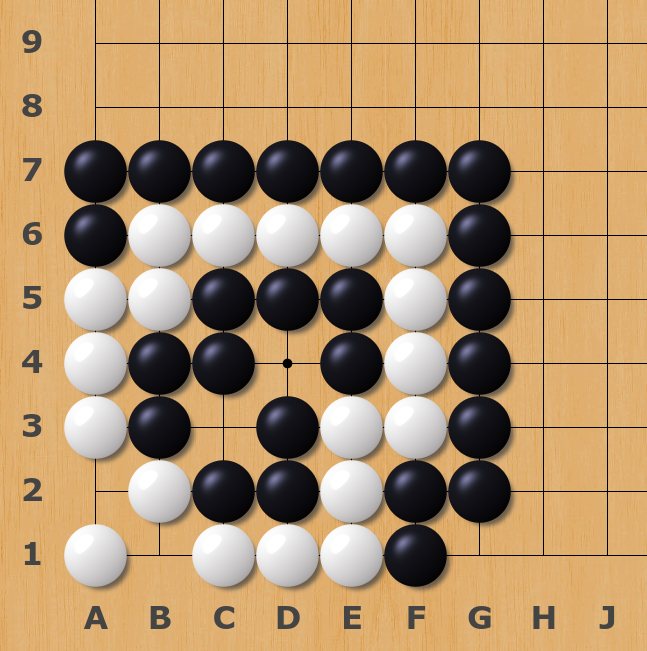

# Shape of the Week: Two-Headed Snake
## False Eye? Live, or Dead?
Today, we are going to talk about an extraordinary kind of eye. The first lesson we learn to Go is pieces need two true eyes to live. Generally speaking, for an eye at the edge or corner of the board, if any of the diagonal position is captured by the enemy, it becomes a false eye. For an eye in the middle of the board,  if two of diagonal position is captured by the enemy, it becomes a false eye. See [Basic shapes of a false eye](https://senseis.xmp.net/?FalseEye). But can you come up with a counterexample? How about this? Are the white's eyes false eyes or true eyes? Can you kill the white?

The while pieces chain together to form a cycle. Though none of the white eyes looks like a true eye, the black cannot kill the white. Don't feel confused. What is rational is actual and what is actual is rational. The common sense that two true eyes make your pieces alive is talk of experience, which is a great summary true most of the time. But common sense is not the full story. This peculiar shape in Go is called the two-headed snake, or two-headed dragon.

## Two-Headed snake (双头蛇)
A *Two-Headed Snake* (also known as *Two-Headed Dragon*, or *Dragon Eats its Own Tail*) is a group that has [two eyes](https://senseis.xmp.net/?TwoEyes) that are at first sight [false eyes](https://senseis.xmp.net/?FalseEye), nevertheless these two eyes are enough for [living](https://senseis.xmp.net/?Alive). [5]

Now, use your imagination, could you come up with more instances of Two-Headed snakes? What would they look like if they occur at the corners of the board,  edges of the board, and middle of the board?

- ### Around the corner

- ### On the edge 

- ### Matryoshka doll !

## Professional Games 
Though rare, Two-headed snakes happened multiple times in professional games. The most famous game is the one that Kim Jiseok played against Chio Cheolhan in a KB Baduk league game in 2016. Chio Cheolhan played the black, and Kim Jiseok played the white. (Full game commentary available on Yike Weiqi at this [link](https://share.yikeweiqi.com/gonews/detail?id=37003&type=WeixinReadCount), and full game record can be downloaded from this [link](Go-records/Chio-Cheolhan-VS-Kim-Jiseok2016.sgf)) [1]

Chio Cheolhan is one of the top players in the world and is known as the viper in the Go games. He started his attack at his 105th move. Kim Jiseok counterattack with a tsuke (see white 106). The fierce battle began. Where white moved around, the black chased after. In the end, white had no true eyes at all but accidentally joined with its tail. As white played the 132nd move, it became a two-headed snake and lived.

## More two-headed snake records:
It's a bit hard to search for professional games that contain two-headed snakes. Fortunately, a fellow Go player collected and organized all recorded two-headed snake shapes that occurred in professional games in his [website](https://homepages.cwi.nl/~aeb/go/misc/snakes/snakes.html). 

## Thought-Provoking Problem
- ### Black first to kill white (Easy)
  The white seems weak, but it is connected end to end. As a result, false eyes could have the same effect as true eyes here. To kill the white, the black needs to consider more carefully ...... (Credit to Bilibili content creator [云小天1118](https://www.bilibili.com/video/BV1jk4y1R7E9)) [2]
  

- ### Black first to live (Hard)
  Selected from *Fa Yang Lun*(发阳论). Hint: Black wants to connect itself from end to end.
  

  **Solution**: Wikipedia [False eyes and living](https://zh.wikipedia.org/wiki/%E5%81%87%E7%9C%BC%E6%B4%BB), end of the wiki.

## References: 
- [1] 大富豪 魏征梦境斩龙王?太子出海扬双头 [https://share.yikeweiqi.com/gonews/detail?id=37003&type=WeixinReadCount](https://share.yikeweiqi.com/gonews/detail?id=37003&type=WeixinReadCount) 
- [2] 鬼手魔手绝妙好题，首尾相顾笔走龙蛇，两假眼诡秘难逃生天 [云小天1118 https://space.bilibili.com/282175413](https://space.bilibili.com/282175413) 
- [3] 假眼活 [https://zh.wikipedia.org/wiki/%E5%81%87%E7%9C%BC%E6%B4%BB](https://zh.wikipedia.org/wiki/%E5%81%87%E7%9C%BC%E6%B4%BB) 
- [4] False eyes and snakes, [https://homepages.cwi.nl/~aeb/go/misc/snakes/snakes.html](https://homepages.cwi.nl/~aeb/go/misc/snakes/snakes.html) 
- [5] Two-Headed Dragon [https://senseis.xmp.net/?TwoHeadedDragon](https://senseis.xmp.net/?TwoHeadedDragon)