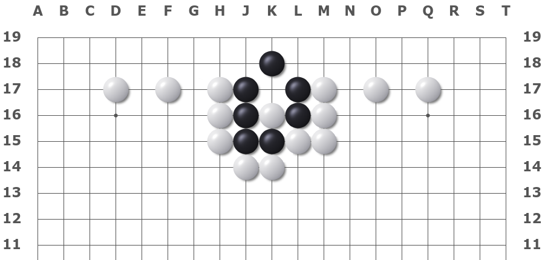

# Go of the Week: Point of Symmetry

When right and left have the same shape, there is a play in the center. 

​																															-- Old proverb in Go

Go board is a symmetric board. Hence, it's not uncommon to see symmetry shapes in Go. When a symmetric shape appears in Go, the point of the symmetry has the potential to be a really good move. The proverb relates in many ways to the idea of [miai](https://senseis.xmp.net/?Miai). (A move with double purpose). [1] Playing at the symmetry sometimes creates two good sweet points, so if the opponent plays one, you can play the other. 

## Fuseki (Opening phase of a game)

When the black and the white are of the mirror shape of each other, the center becomes the most important strategic location.

Following is a mirror game shown in the *Hikaru-no-go*. Toya Koyo plays the white. Because black chess and white chess are completely symmetrical, the center point is of great value. 

## Thought-Provoking Problem
- ### White first to escape
  [Tortise shape](https://www.101weiqi.com/book/levelorder/5/74/), selected from Xuanxuanqijing.

  

- ### White first to kill the Blacks
  [Goose shape](https://www.101weiqi.com/book/levelorder/5/68/), selected from Xuanxuanqijing.

  

- ### Black first to kill the Whites
  [Raiders](https://www.101weiqi.com/book/xuanxuanqijin/90/7104/), selected from Xuanxuanqijing.

  

## References: 
- [1] Play on the Point of Symmetry [https://senseis.xmp.net/?PlayOnThePointOfSymmetry](https://senseis.xmp.net/?PlayOnThePointOfSymmetry) 
- [2] Miai [https://senseis.xmp.net/?Miai](https://senseis.xmp.net/?Miai) 
- [3] 玄玄棋经-桥本宇太郎解说 [https://www.101weiqi.com/book/levelorder/5/?page=2](https://www.101weiqi.com/book/levelorder/5/?page=2) 