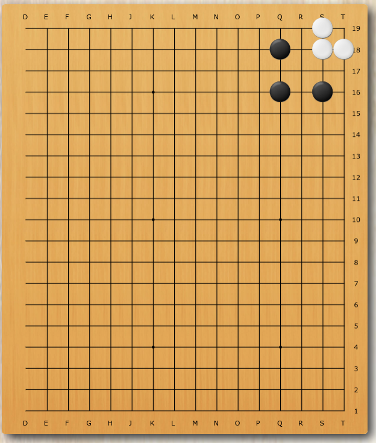

# Go of the Week: Syrup Ko

Ko is one of the most attractive parts of Go. But the Ko we introduced today is a bit different. It makes your game incredibly boring. It's called Syrup Ko. 

## Syrup Ko

Syrup? It sounds like a sweet Ko.

Not at all. You will hate it occurs in your game. Why? It is called Syrup Ko because it's too sticky!  It turns out it has nothing to do with sweetness but slows down your game speed. 

#### Basic Shape
The following the basic shape of a Syrup Go. (Left bottom corner) Suppose it's the black's turn now. The only move if the black wants to win the battle at the left bottom corner would be B3. 

&nbsp;

#### Usual progress of the game
The progress of the game will be as follows:

By the rule of the Go, since the white just captures a Ko, the black cannot capture it back immediately. Suppose the black does not have a good kozai (Certain move that your opponent must respond to, so after that you can capture the original Ko back), the black can play anywhere on the board. 

Now it's the white's turn, and the only move, if the white wants to win the battle at the left bottom corner, would be B2. In fact, it's a compulsory move because if the white does not play here, all not only the blacks will live but also the whites at the left bottom corner would all die. The progress of the game will continue as follows: 

As a result, we have to waste 4 moves in the syrup ko for every effective move we play. Only the moves numbered as a multiple of 5 are effective, which means our game speed is slow down by a factor of 5. For a game with 200 moves, now we are going to play 1000 moves! No wonder it's called syrup ko. 

&nbsp;

#### Some other options
The black can choose to give up the syrup ko in exchange for two moves elsewhere on the board. So it is for the white. But if the syrup is too valuable to give up for both players, they have to live with it, and the game would become incredibly boring.

- ##### the White gives up
  

&nbsp;

- ##### the Black gives up
  

  

&nbsp;

## Tsumego Problem of the week
Last week we talked about symmetry. So let's look at two more symmetry problems to help you consolidate your skills
- ### Black first, what will happen?
  [Three immortals coming out of the cave](https://www.101weiqi.com/book/xuanxuanqijin/90/1555/), selected from Xuanxuanqijing.

  

&nbsp;

- ### White first, what will happen?
  [Three immortals bringing auspicious omens](https://www.101weiqi.com/book/xuanxuanqijin/90/18347/), selected from Xuanxuanqijing.

  

&nbsp;

## References: 
- [1] 一点都不甜的“糖浆劫” [https://www.bilibili.com/video/av58332163/](https://www.bilibili.com/video/av58332163/) 
- [2] 玄玄棋经-桥本宇太郎解说 [https://www.101weiqi.com/book/xuanxuanqijin/](https://www.101weiqi.com/book/xuanxuanqijin/) 