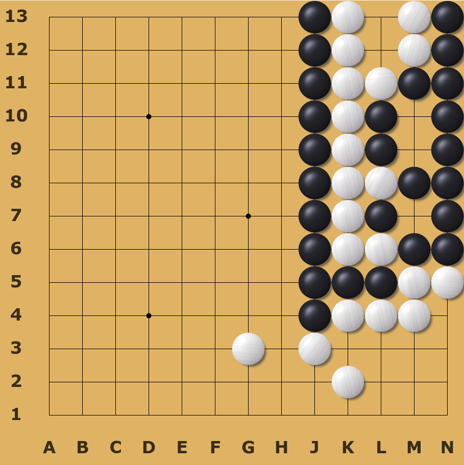
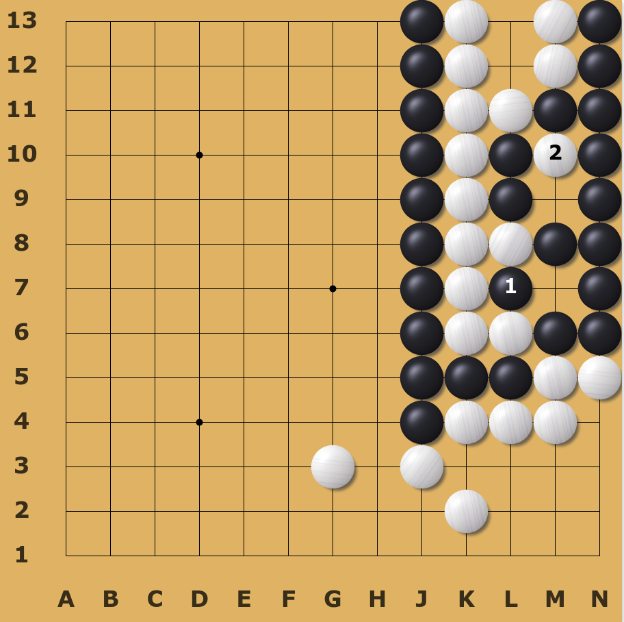
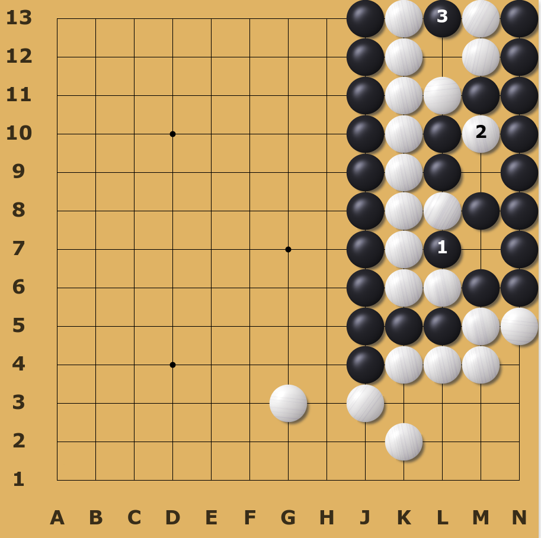
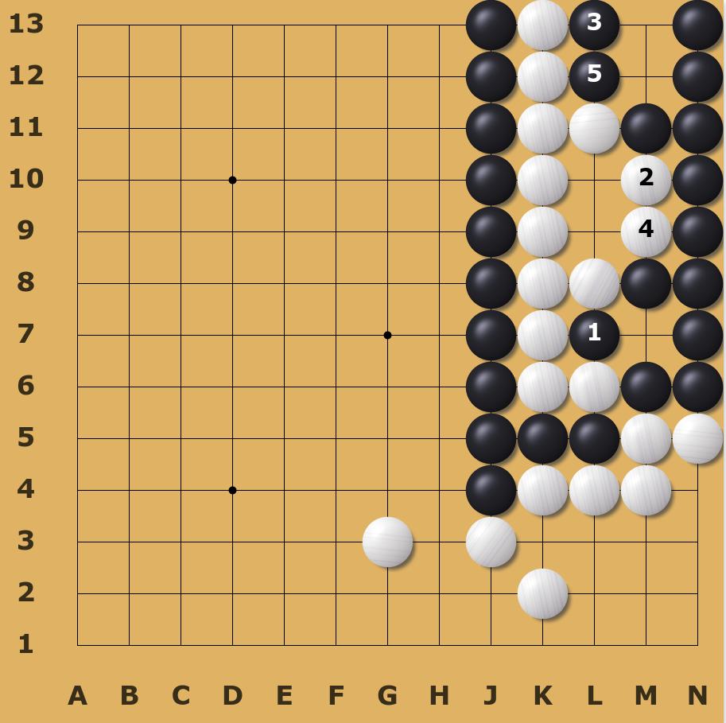
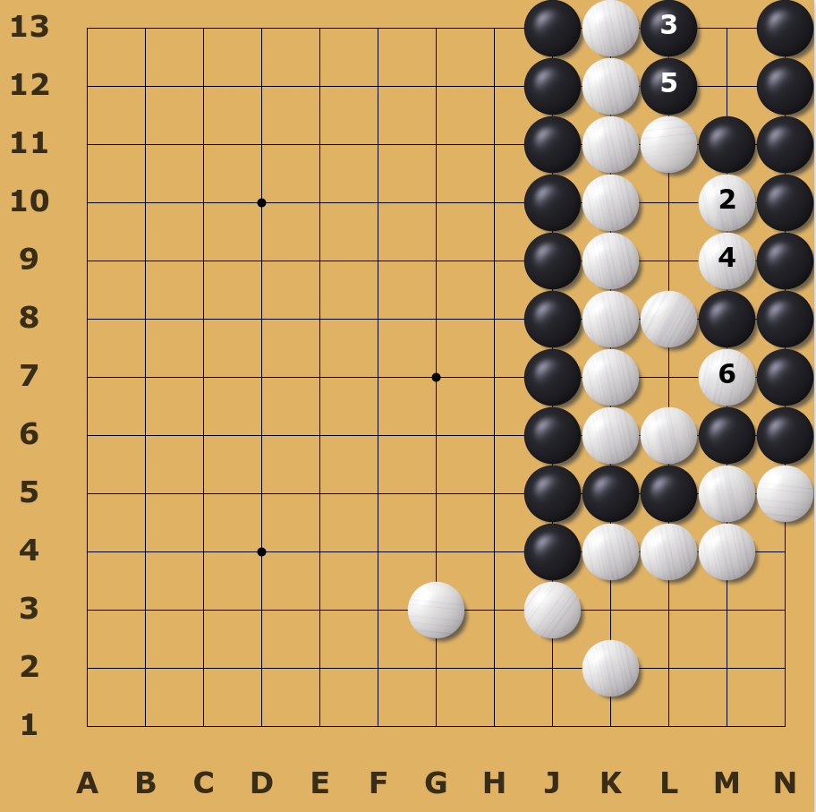
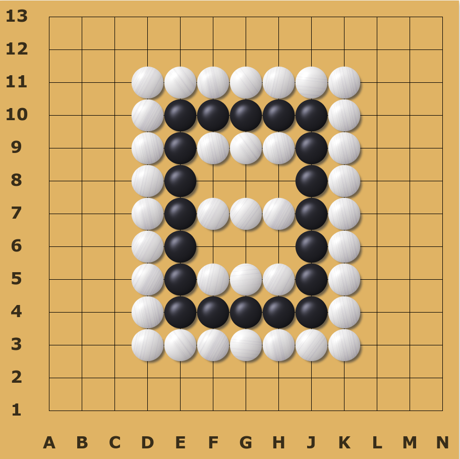
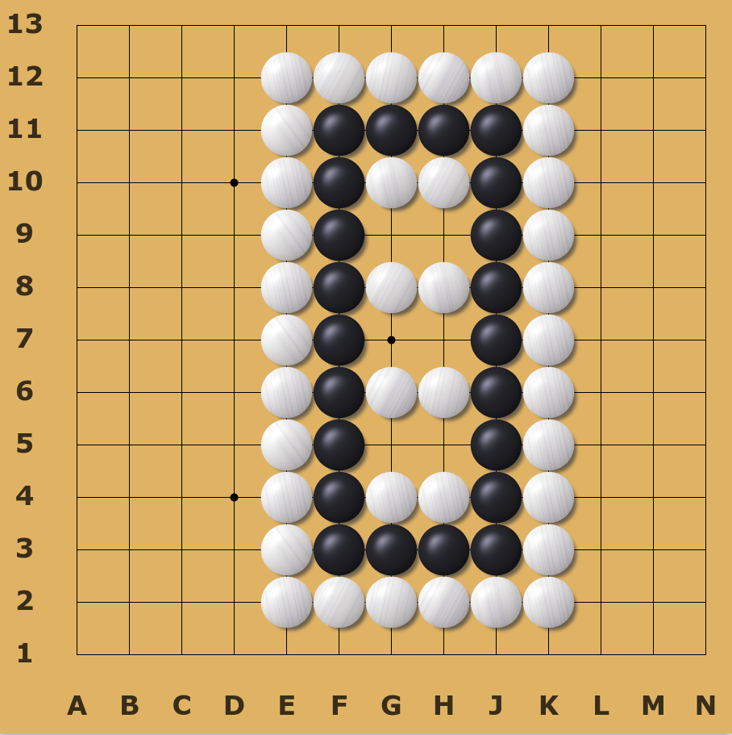

# Go of the Week: Two-Pieces Ko

Ko is one of the most attractive parts of Go. Last time we talked about syrup ko, which is really sticky. This time, we change the shape of the syrup ko a bit, and get another strange shape in Go, two-pieces Ko

## Two-Pieces Ko
This ko is unique in that both the white and black will continue to capture 2 stones from each other, and this forms an endless cycle.

Suppose the black captures the ko first, then the white can play at (M, 10). This is an internal kozai, so black has to respond. The game will progress as follow:

After the white captures the ko back, the black now has to play at (L, 10). A new cycle begins ...

Similar to a cycled triple ko, every move here are compulsory, and once the cycle starts, we cannot stop it. We call this shape the two-pieces endless ko. 

## Tsumego Problem of the week
This week we will introduce some unusual cases of seki (impasse)
- ### Can you kill the black or white (1)?
  
  

&nbsp;

- ### Can you kill the black or white (2)?

  

&nbsp;

## References: 
- [1] 杂谈“围棋八怪” [https://wemp.app/posts/0569b0ae-fee5-4ee6-860e-45bbcb10c2af](https://wemp.app/posts/0569b0ae-fee5-4ee6-860e-45bbcb10c2af) 