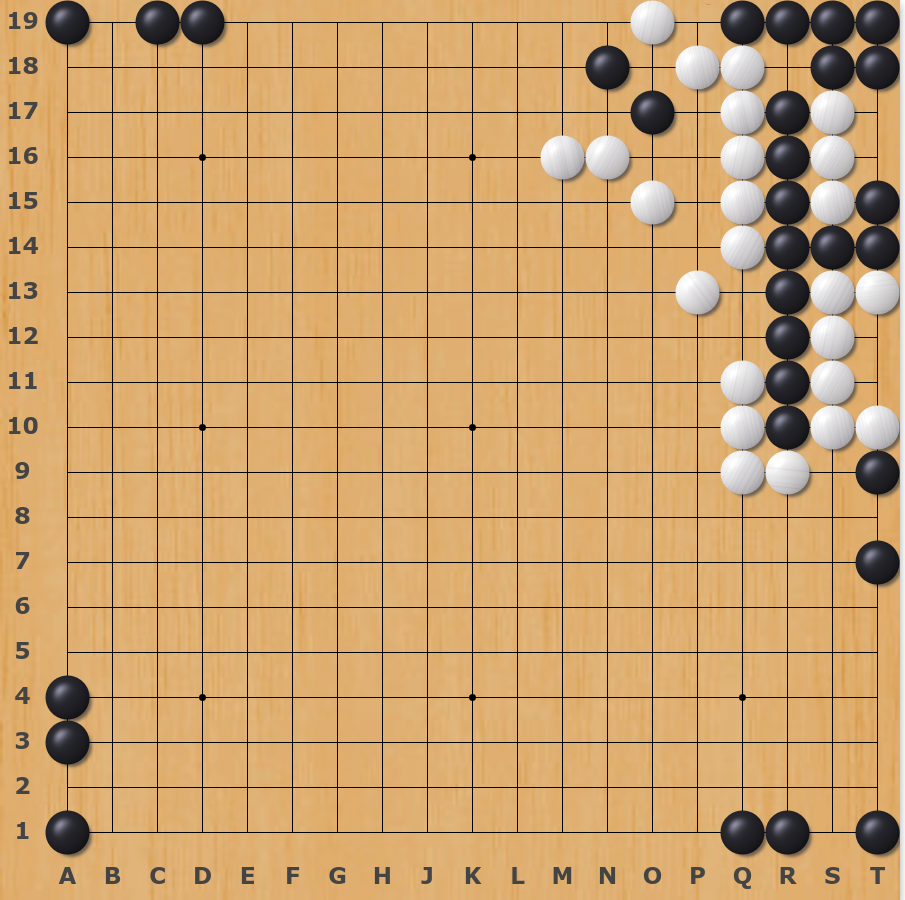
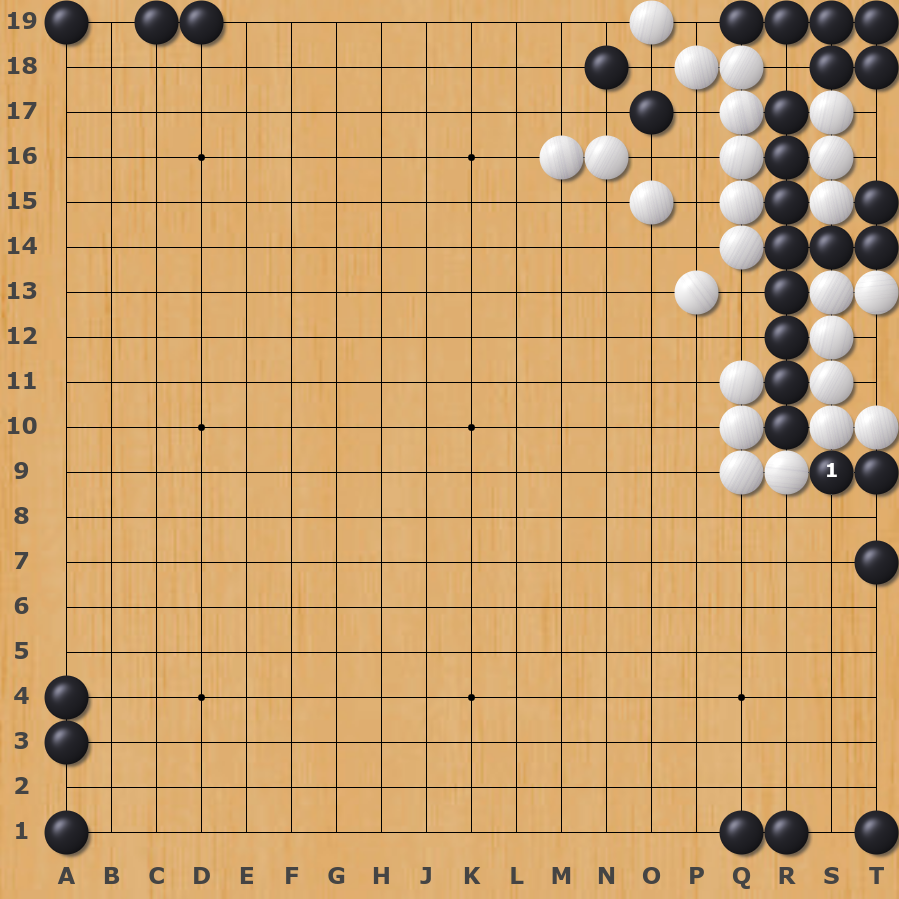
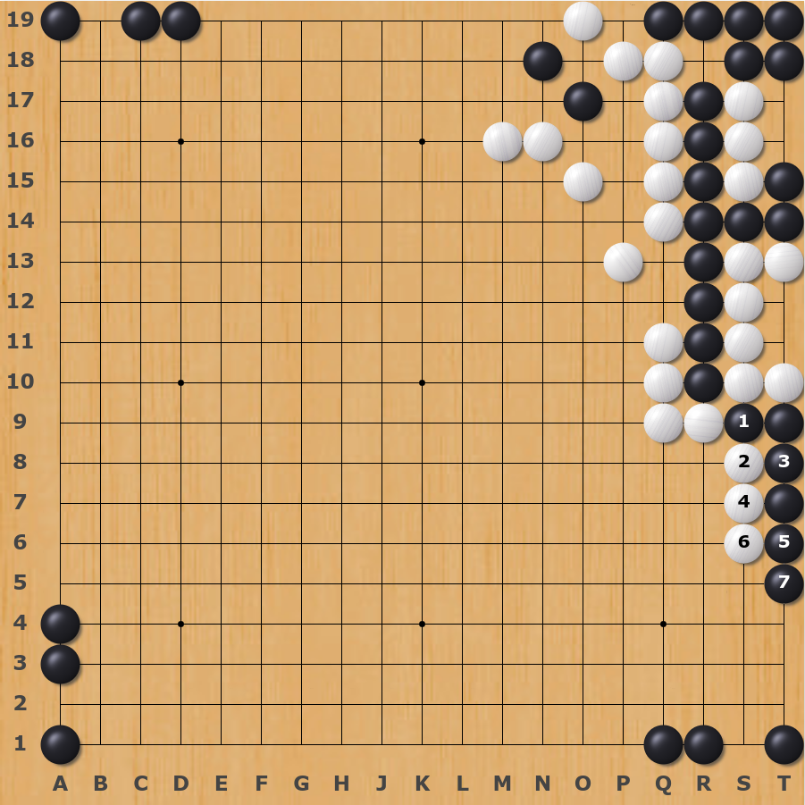
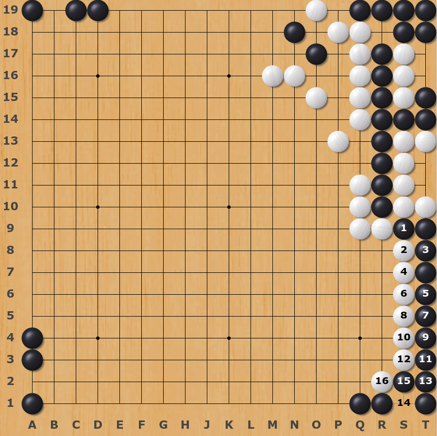
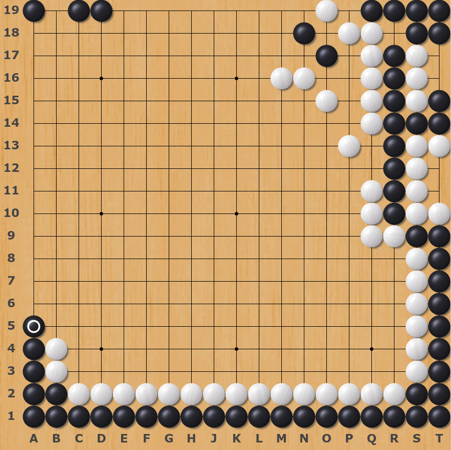
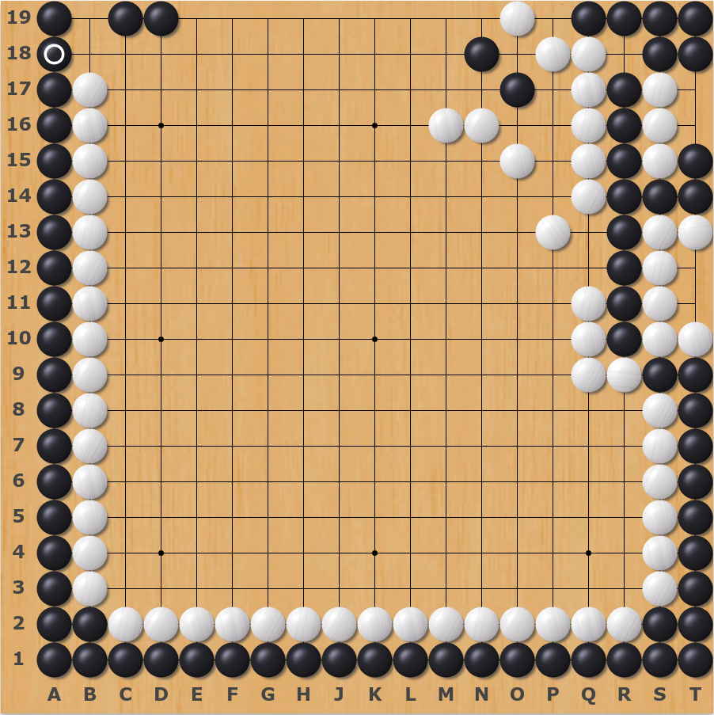
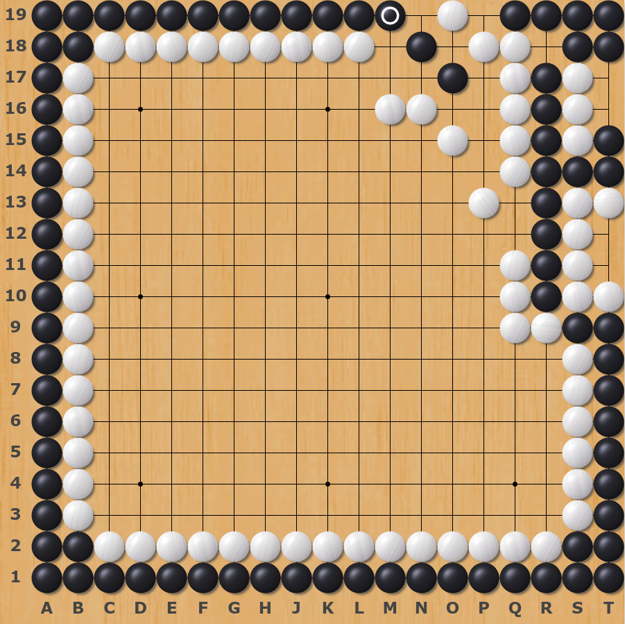
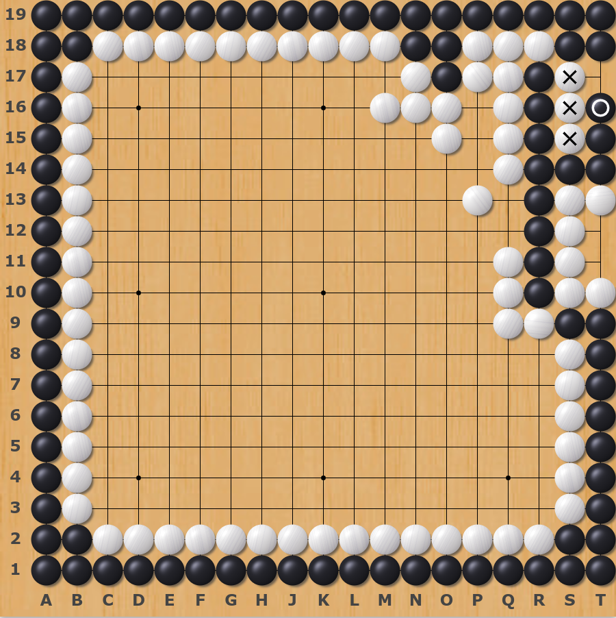
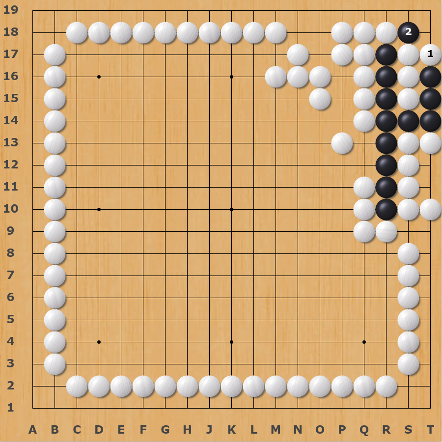

# Go of the Week: The most hilarious tsumego

So far, we have done a lot of life-and-death exercises every week, so today we will look at something different. When I was wandering around a forum, I found this treasure in a post called *How to elegantly sacrifice your pieces*. It makes my day. Let's see it.

## Black first to live

### The only starting move
And it's all the way to the end

### Temple run 

I just wanna run, hiding away ...

Run because they're chasin' me down ...

I just wanna run, throw it away ...

Run before they're findin' me out ...

...

And it turns out, after the white capture all the black march, it's a shape of [under the stones](https://senseis.xmp.net/?UnderTheStones)

## We live, hurrah ! (The End)

&nbsp;

&nbsp;

## References: 
- [1] 知乎-围棋如何优雅地弃子? [https://www.zhihu.com/question/23734755](https://www.zhihu.com/question/23734755) 